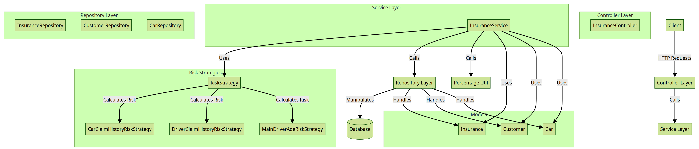
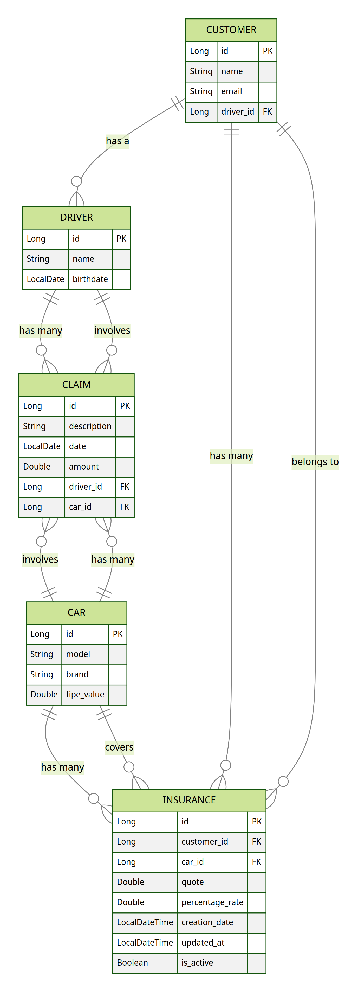

# Insurance Service

## Descrição
Este projeto é um serviço backend para calcular orçamentos de seguro de carros.

## Tecnologias Utilizadas
- Java 17
- Spring Boot
- Spring Data JPA
- H2 Database
- Lombok
- Gradle

## Configuração do Projeto
1. Clone o repositório:
   ```sh
   git clone https://github.com/seu-usuario/insurance-service.git
    ```
2. Na raiz do projeto compile e rode a aplicação:
    ```sh 
   ./gradlew build
   ./gradlew bootRun
    ```
- **Observações**
  - Por padrão a API rodará na porta 9090, esse valor pode ser alterado via propriedade `server.port` no arquivo `application.properites`
  - Para facilitar os testes foi criado a classe `DataLoader` que carrega no banco alguns valores ficticios.

## Diagrama Arquitetural



## Modelagem da aplicação



## Documentação da API

A documentação da API está disponível no arquivo [api-doc.yaml](api-doc.yaml). Consulte esse arquivo para obter detalhes sobre os endpoints e os modelos de dados.

## Requisições de exemplo
Cadastro de Orçamento

    POST /insurance/budget
    curl --silent --location --request POST 'http://localhost:9090/insurance/budget' \
        --header 'Content-Type: application/json' \
        --data-raw '{
        "carId": 2,
        "customerId": 2
    }'

Consulta de Orçamento

    GET /insurance/budget/{insuranceId}
    curl --silent --location --request GET 'http://localhost:9090/insurance/budget/1'

Atualização de Orçamento

    PUT /insurance/budget/{insuranceId}
    curl --silent --location --request PUT 'http://localhost:9090/insurance/budget/2' \
        --header 'Content-Type: application/json' \
        --data-raw '{
        "carId": 1,
        "customerId": 1
    }'
Remoção de Orçamento

    DELETE /insurance/budget/{insuranceId}
    curl --silent --location --request DELETE 'http://localhost:9090/insurance/budget/1'
